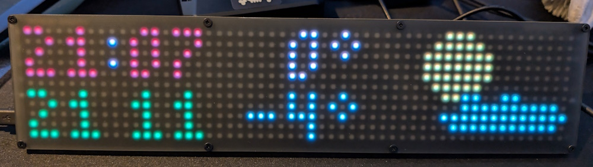

# galactic-weather-clock
 A clock showing the weather on a Pimoroni Galactic Unicorn

### What is it?

*This is a slimmed down version of Raphaël Velt's clock.
*I felt their version was a bit to busy. 
*Removed - birds, scrolling updates, hearts

*
*Added   - Feels like temprature, formatting of code

A Micropython script for Pimoroni's Galactic Unicorn [buy from Pimoroni shop](https://shop.pimoroni.com/products/galactic-unicorn) that shows a clock as well as the current weather.

It uses the [Open Meteo API](https://open-meteo.com/en/docs) to retrieve the weather forecast as well as to adjust the time zone.

### Preview

### Dependencies

 * You need version 1.19.18 of the Micropython firmware for the Raspberry Pi Pico W (It uses the new HSV pen function from that release). Check <https://github.com/pimoroni/pimoroni-pico/releases> for Firmware updates

### Description of files

 * [connect.py](connect.py): creates a WIFI network connection. You need to populate a file named `WIFI_CONFIG.py`.
 * <location_config.py>: This is where you put your latitude, longitude and timezone to get your local forecast.
 * <weatherclock_assets.py>: The custom fonts used for the digits, and the icons used to display weather states.
 * <weatherclock.py>: The main source code for the weather clock.

 Link to the original and more fun version 
<https://github.com/raphv/galactic-weather-clock>
